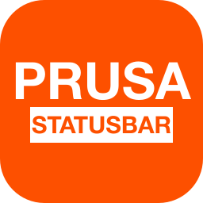
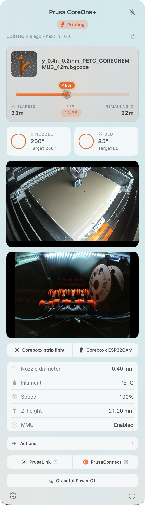
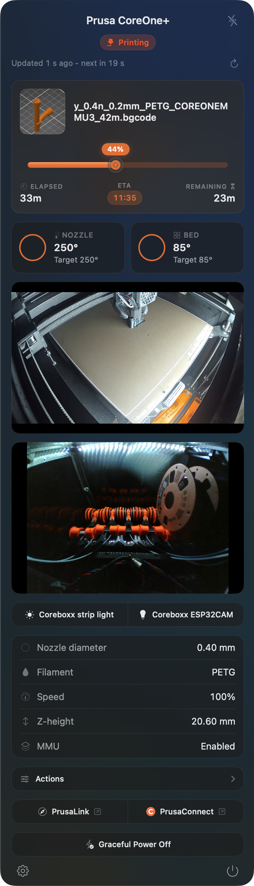
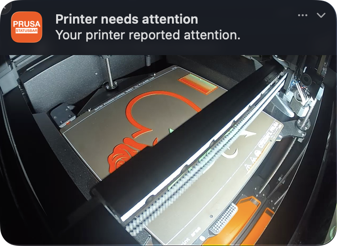
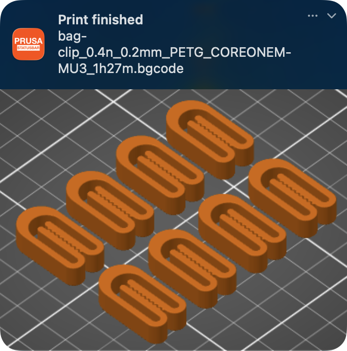
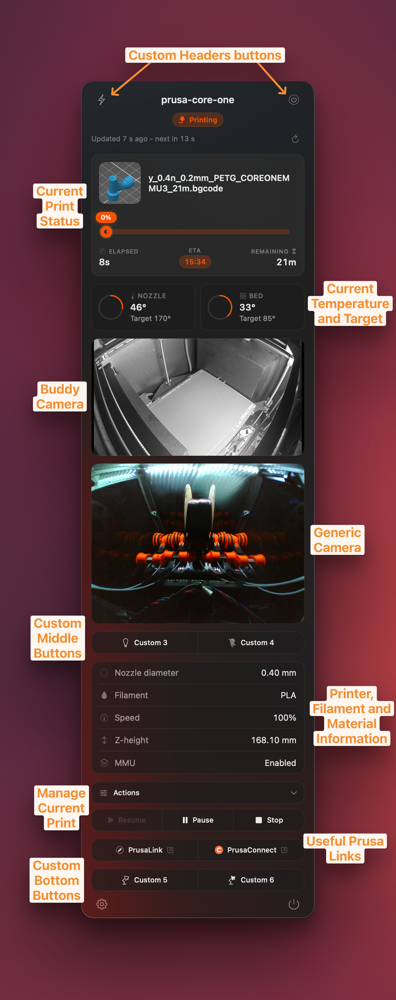

<div align="center">



# Prusa StatusBar

**A native macOS menu bar app for your PrusaLink-equipped 3D printer.**

Watch your prints from the menu bar: live state, progress, temperatures,
and notifications, right next to the clock.

[](https://github.com/deimosfr/Prusa-StatusBar/actions/workflows/ci.yml)
[](https://github.com/deimosfr/Prusa-StatusBar/releases/latest)
[](LICENSE)
[](https://www.apple.com/macos/)
[](#homebrew-recommended)

<table>
<tr>
<td align="center"><strong>Menu bar light</strong></td>
<td align="center"><strong>Menu bar dark</strong></td>
</tr>
<tr>
<td>
<a href="assets/screenshot_example_light.png"></a>
</td>
<td>
<a href="assets/screenshot_example_dark.png"></a>
</td>
</tr>
<tr>
<td align="center"><strong>Notification with snapshot</strong></td>
<td align="center"><strong>Notification with preview</strong></td>
</tr>
<tr>
<td>
<a href="assets/screenshot_notif_camera.png"></a>
</td>
<td>
<a href="assets/screenshot_notif_preview.png"></a>
</td>
</tr>
</table>

</div>

https://github.com/user-attachments/assets/85046996-f5a1-4bcb-9e79-58f294655967

---

## Features

- **Live state in the menu bar**: idle, printing, paused, finished, stopped, busy, needs attention, or disconnected. Each state has its own icon and color so you can read it at a glance.
- **Progress and remaining time** shown next to the clock. Toggle either one off if you want a quieter menu bar.
- **Job details in the dropdown**: thumbnail of the current print, elapsed time, remaining time, and ETA.
- **Two progress bar styles**: filament *Spool* or *Classic*, your call.
- **Temperatures**: nozzle and bed, current vs target, with ring gauges.
- **Optional extras**: show print speed, Z height, nozzle diameter, MMU status, and filament type in the dropdown when you want them.
- **Job controls** without leaving the menu bar: pause, resume, stop.
- **Detach to a floating window**: pop the dropdown out into a dedicated, always-available window with the same content. Useful for a second monitor or keeping the print visible while another app has focus.
- **Quick links** to open PrusaLink (the local web UI) or PrusaConnect (the cloud dashboard). Buttons dim when the printer is unreachable or the link is not configured, and either button can be hidden if you do not use it.
- **Custom HTTP action buttons**: add your own buttons in the top, middle, or bottom row of the dropdown to POST or GET against any endpoint (Home Assistant, smart plugs, your own scripts). Optional auth headers and secrets are stored in the Keychain.
- **Optional camera tile**: for the Prusa Buddy 3D Camera, the live RTSP stream shows up directly in the menu bar. RTSP is **off by default** on the camera, so you must enable it once in PrusaConnect under *Camera > Camera control* (see the [Camera section](#camera-optional) below). For any other camera, point Prusa StatusBar at an HTTP/HTTPS still or stream URL and it shows up in the same tile. Video stays on your local network.
- **Native notifications** when a print starts, finishes, or the printer needs your attention. Each notification type can be toggled independently. When a camera is configured (Buddy or generic), the notification embeds a **live camera snapshot** captured at the moment of the event; otherwise it falls back to the gcode thumbnail.
- **Fallback printer URL**: if your printer hops between Wi-Fi and Ethernet, set a backup URL and the app falls back to it automatically.
- **Configurable refresh interval**, with separate values for when the printer is connected vs disconnected, so you can save battery on the road.
- **Custom printer name** override, useful if you have more than one Prusa nearby.
- **Available in 10 languages**: English, Czech, German, Spanish, French, Italian, Japanese, Polish, Brazilian Portuguese, and Simplified Chinese.
- **Launch at login** through Apple's `SMAppService`, no LaunchAgents to babysit.
- **Privacy first**: your PrusaLink API key lives in the system Keychain, the app runs in the macOS App Sandbox with the network-client entitlement only, and there is no telemetry.

<div align="center">
<a href="assets/screenshot_features.png"></a>
</div>

## Install

### Homebrew (recommended)

```sh
brew install --cask deimosfr/tap/prusa-statusbar
```

### DMG

1. Download the latest `PrusaStatusBar-<version>.dmg` from the [Releases page](https://github.com/deimosfr/Prusa-StatusBar/releases/latest).
2. Open the DMG and drag the app into `/Applications`.
3. Launch it. Releases are signed with an Apple Developer ID and notarized
   by Apple, so Gatekeeper accepts the app on first launch with no extra
   steps.

### Build from source

For contributors: see [CONTRIBUTING.md](CONTRIBUTING.md).

## Connect your printer

1. In the PrusaLink web UI, generate an API key under
   *Settings > User > API Key* (the path may differ slightly between firmware versions).
2. Launch Prusa StatusBar.
3. Open *Preferences...* from the menu bar dropdown.
4. In the **Printer** tab, enter the printer URL (for example
   `http://prusa-mk4.lan` or `http://192.168.1.42`) and paste the API key.
   The key is saved to the system Keychain.

Optionally set a **fallback URL** in the same tab if your printer is
reachable on more than one address.

### Camera (optional)

If you have a Prusa Buddy 3D Camera, open
*Preferences > Printer > Buddy Camera* and enter the camera's own IP or
hostname (not the printer's); its RTSP stream then shows up as a live
tile in the menu bar. For any other camera that serves an HTTP/HTTPS
still or stream, use *Preferences > Printer > Generic Camera*.
Auth credentials are stored in the Keychain. Nothing leaves your network.

> **Important: enable RTSP on the Buddy Camera first.** The Buddy 3D
> Camera ships with its RTSP stream **disabled by default**. Open
> PrusaConnect, go to *Camera > Camera control*, and turn RTSP on for
> this camera. Without this step the camera tile cannot connect even if
> the IP or hostname is correct. See Prusa's
> [Buddy 3D Camera article](https://help.prusa3d.com/article/buddy3d-camera_821264#features)
> for the exact steps.

## Privacy and security

- **App Sandbox** enabled. Entitlements: `app-sandbox` and `network.client`.
- **Keychain only** for the PrusaLink API key. Never written to `UserDefaults`,
  never logged.
- **No telemetry**. No analytics, no crash reporters phoning home.
- **Hardened Runtime** enabled for Release builds.
- For vulnerabilities, see [SECURITY.md](SECURITY.md). Please do not file public issues.

## Contributing

PRs are welcome. Read [CONTRIBUTING.md](CONTRIBUTING.md) and
[CODE_OF_CONDUCT.md](CODE_OF_CONDUCT.md) before opening one.

## Acknowledgements

- [Prusa Research](https://www.prusa3d.com/) for PrusaLink.
- [`go2rtc`](https://github.com/AlexxIT/go2rtc) (MIT) for the camera relay.
- [Cookie](https://fonts.google.com/specimen/Cookie) (SIL OFL) for the bundled UI font.

See [NOTICE](NOTICE) for the full attribution list.

## Support

If this app makes your printing life easier, you can fuel further work with a coffee.

<a href="https://www.buymeacoffee.com/deimosfr"></a>

## License

Licensed under the Apache License 2.0. See [LICENSE](LICENSE).
